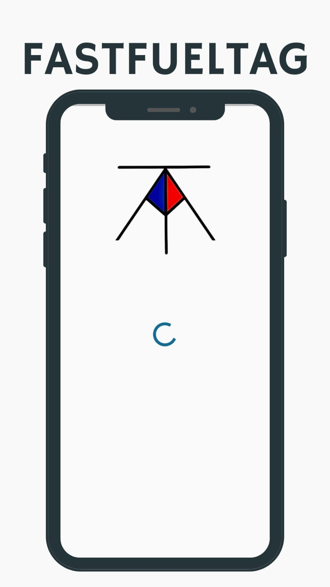
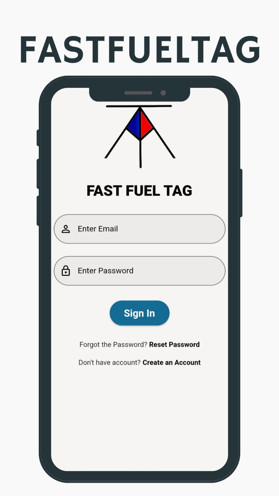
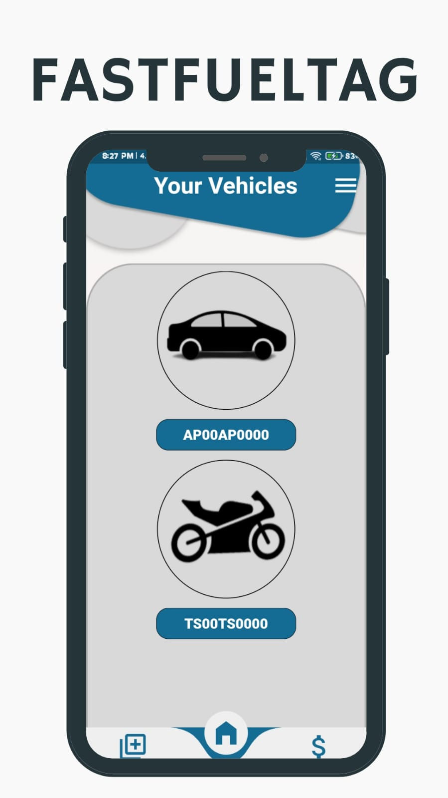
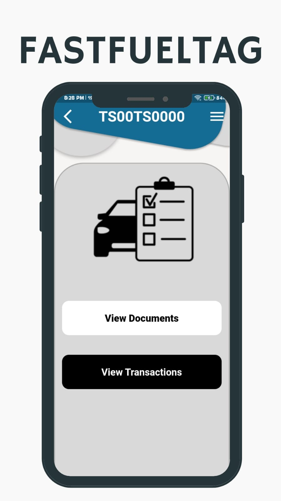
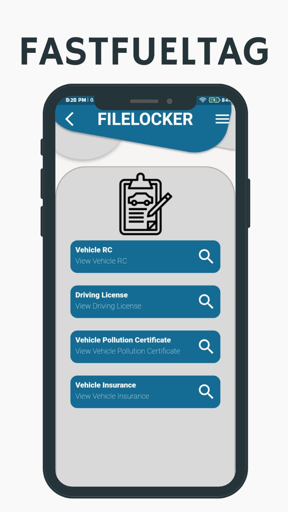
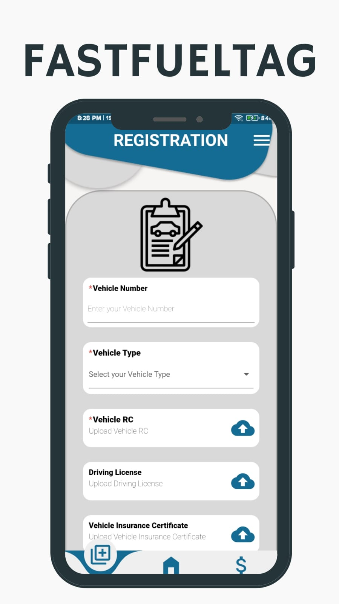

#  Fast Fuel Tag
A comprehensive Flutter application designed to digitize vehicle fuel payments and streamline legal compliance. Fast Fuel Tag acts as a digital wallet and document vault, allowing vehicle owners to securely upload and link mandatory registration documents to their profiles.

## 📸 Application Previews

  
  
  

  
  
  

## 🚀 Key Features

* **Secure Document Vault:** Users can seamlessly upload PDFs or images of their RC, Driving License, Insurance, and Pollution Certificates using the `file_picker` package.
* **Firebase Storage & Firestore Integration:** Uploaded files are securely hosted on Firebase Storage, with auto-generated URLs and vehicle metadata mapped to a real-time Cloud Firestore NoSQL database.
* **Strict Data Validation:** Custom Regular Expressions (Regex) enforce strict validation rules for official vehicle license plate formats prior to cloud uploads.
* **Persistent Sessions:** Frictionless login experiences achieved through Firebase Auth coupled with local `shared_preferences`.
* **Glassmorphism UI:** A premium, modern aesthetic leveraging advanced UI techniques like `BackdropFilter` (blur effects) and a fluid `CurvedNavigationBar`.

## 🛠️ Tech Stack

* **Framework:** Flutter (Dart)
* **Backend:** Firebase (Authentication, Cloud Firestore, Cloud Storage)
* **Key Packages:** `file_picker`, `cloud_firestore`, `firebase_storage`, `shared_preferences`, `curved_navigation_bar`, `syncfusion_flutter_pdfviewer`

## ⚙️ Setup & Installation

1. Clone the repository.
2. Add your Firebase `google-services.json` file to `android/app/`.
3. Run `flutter pub get` to fetch all necessary packages.
4. Run `flutter run` to launch the application.
